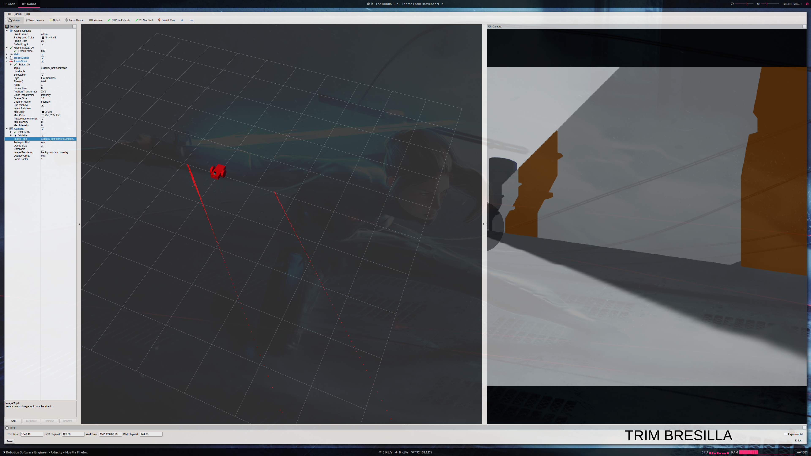

# ROS Localisation and Navigation using Adaptive Monte Carlo Localisation (AMCL)

This repository contains a Robot Operating System (ROS) implementation of  robot model for uses with the ROS navigation stack. The model uses the Adaptive Monte Carlo Localisation (AMCL) method for localization with the MOVE_BASE stack for obstacle avoidance and path navigation.




## Project videos

Please refer to the resources folder, if you want to see some videos of robot performing the navigation.

## Prerequisites

1. [Ubuntu](https://www.ubuntu.com/)

2. Robot Operating System [ROS](http://wiki.ros.org/ROS/Installation).

3. Some ROS packages:

```sh
$ sudo apt-get update
$ sudo apt-get install ros-kinetic-move-base
$ sudo apt-get install ros-kinetic-map-server
$ sudo apt-get install ros-kinetic-amcl
$ sudo apt-get install ros-kinetic-eband-local-planner
$ sudo apt-get install ros-kinetic-global-planner
```

## Installing

Clone this repository in your catkin workspace 'src/' folder.

```sh
$ cd ~/catkin_ws/src/
$ git clone https://github.com/bresilla/robond_project_6
```

Build the project:
```sh
$ cd ~/catkin_ws
$ catkin_make
```

Source the base files in your bashrc file:
```
source ~/catkin_ws/devel/setup.bash
```

## Run the Code

Run the following for the ScratchBot,
```sh
$ cd ~/catkin_ws
$ roslaunch udacity_bot main.launch
```

Run the following for the CostumBot,
```sh
$ cd ~/catkin_ws
$ roslaunch bresilla main.launch
```

Gazebo and Rviz will load automatically.

### RESULTS


